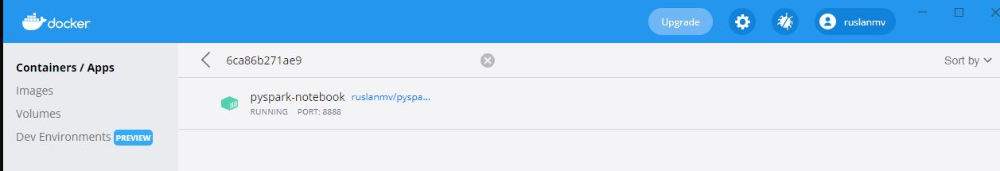
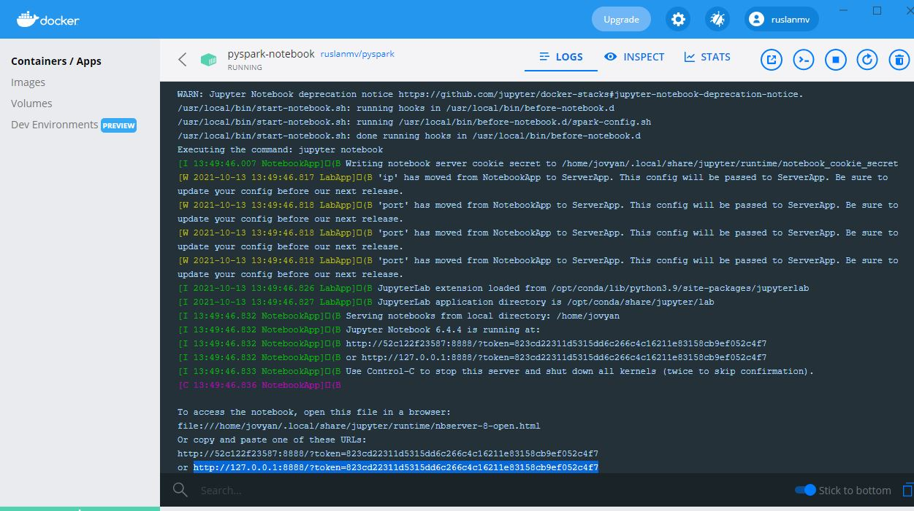
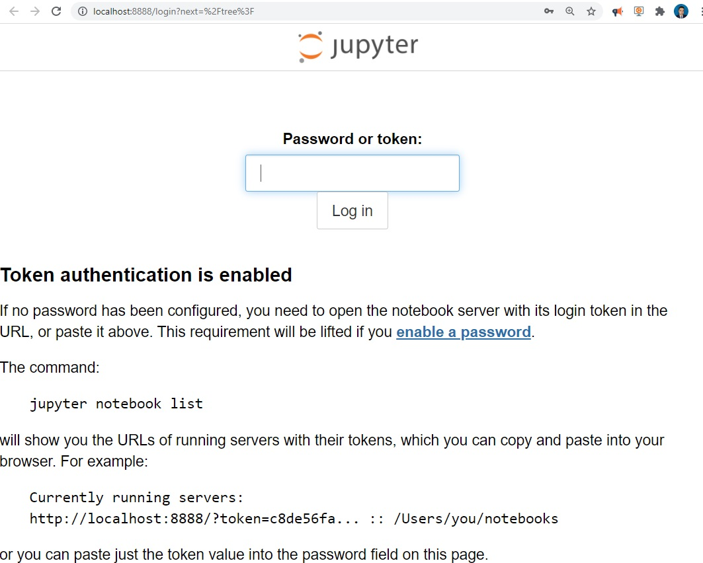
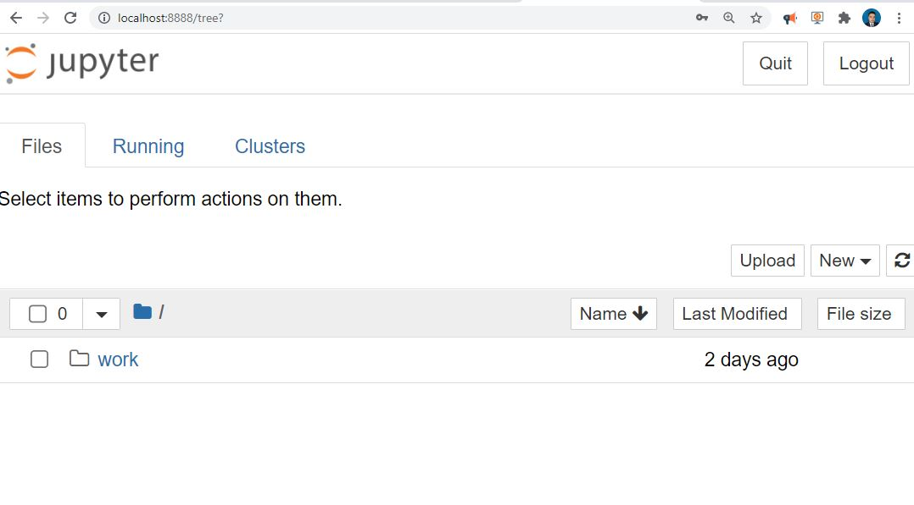
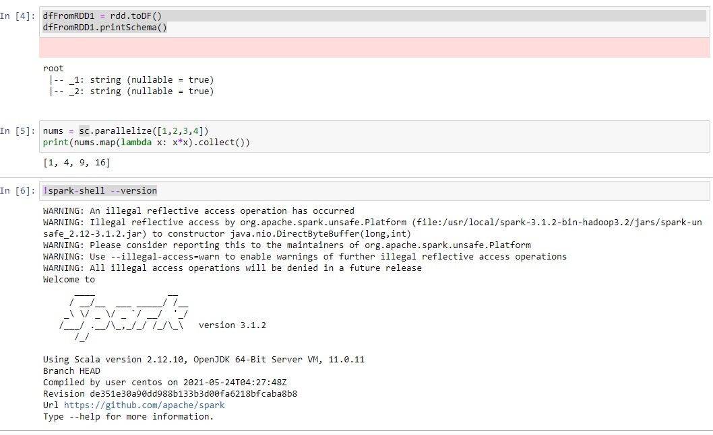
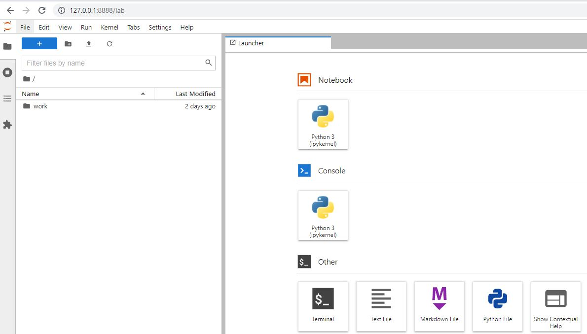
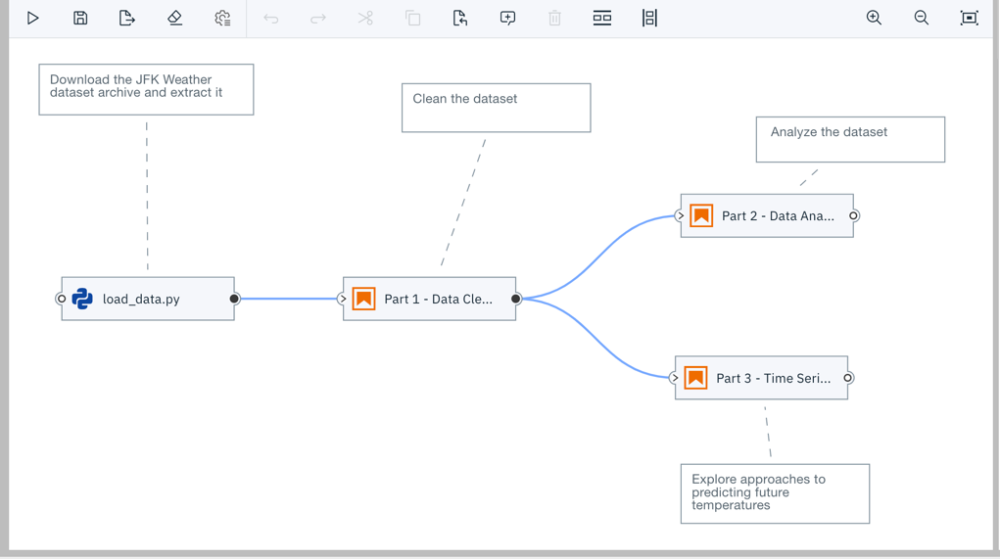
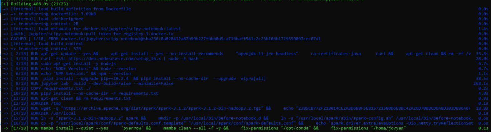
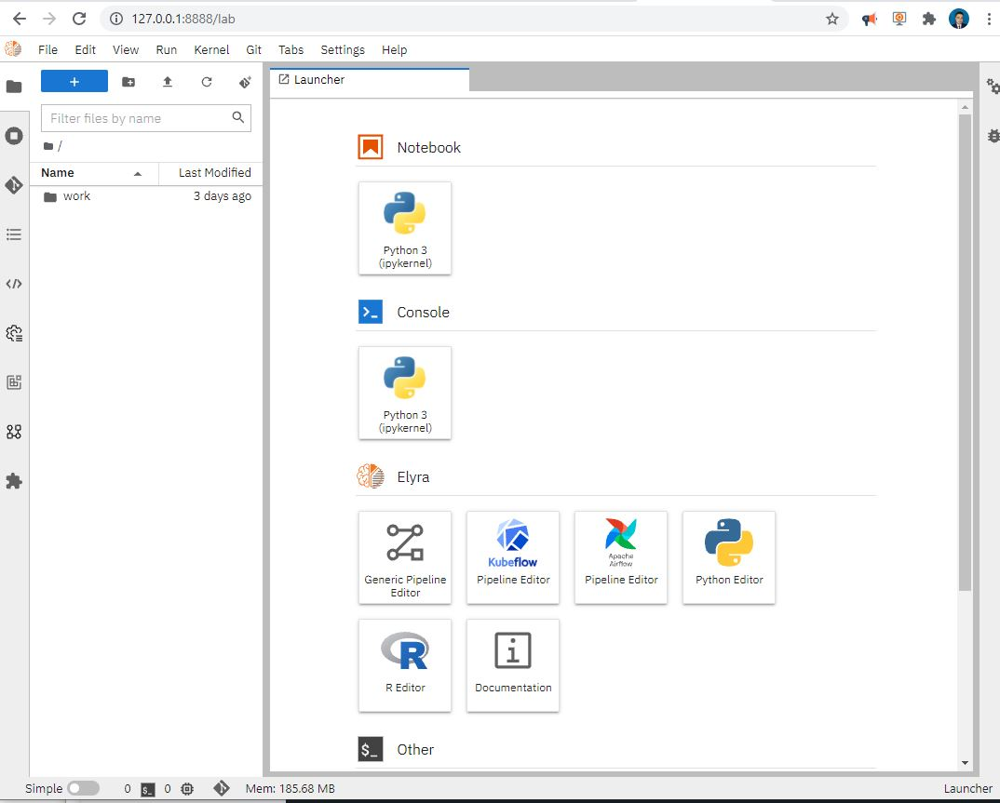

## Docker Container with Pyspark and  Jupyter and Elyra

*How to create Jupyter Notebook Docker Container with Pyspark*


### Custom Pyspark  runtime container images

This repository has three containers **ready to go**:


**Container 1  :Jupyter Notebook with Apache Spark with Python :**

```
docker run -p 8888:8888 ruslanmv/pyspark-notebook:3.1.2
```

the image is stored at  the Docker Hub  [here](https://hub.docker.com/repository/docker/ruslanmv/pyspark-notebook)

**Container 2 : JupyterLab with Apache Spark with Python :**

```
docker run -p 8888:8888 ruslanmv/pyspark-jupyterlab:3.1.2
```

the image is stored at  the Docker Hub  [here](https://hub.docker.com/repository/docker/ruslanmv/pyspark-jupyterlab)

**Container 3 : JupyterLab Apache Spark with Python and Elyra :**

```
docker run -p 8888:8888 ruslanmv/pyspark-elyra:3.1.2
```

The image is stored at  the Docker Hub  [here](https://hub.docker.com/repository/docker/ruslanmv/pyspark-elyra)

If you want to see how were build I will explain how.

## Creating a custom Pyspark  runtime container image


Today we are going to create and load different custom **Jupyter notebook** and **JupyterLab** application with **Pyspark**  in a docker container. The Spark Python template image serves as a base image to build your own Python application to run on a Spark cluster.


The base **Dockerfile**  that we will use is the following:


```bash
# Copyright (c) Jupyter Development Team.
# Distributed under the terms of the Modified BSD License.
ARG OWNER=jupyter
ARG BASE_CONTAINER=$OWNER/scipy-notebook
FROM $BASE_CONTAINER

LABEL maintainer="Jupyter Project <jupyter@googlegroups.com>"

# Fix DL4006
SHELL ["/bin/bash", "-o", "pipefail", "-c"]

USER root

# Spark dependencies
# Default values can be overridden at build time
# (ARGS are in lower case to distinguish them from ENV)
ARG spark_version="3.1.2"
ARG hadoop_version="3.2"
ARG spark_checksum="2385CB772F21B014CE2ABD6B8F5E815721580D6E8BC42A26D70BBCDDA8D303D886A6F12B36D40F6971B5547B70FAE62B5A96146F0421CB93D4E51491308EF5D5"
ARG openjdk_version="11"

ENV APACHE_SPARK_VERSION="${spark_version}" \
    HADOOP_VERSION="${hadoop_version}"

RUN apt-get update --yes && \
    apt-get install --yes --no-install-recommends \
    "openjdk-${openjdk_version}-jre-headless" \
    ca-certificates-java && \
    apt-get clean && rm -rf /var/lib/apt/lists/*

# Spark installation
WORKDIR /tmp
RUN wget -q "https://archive.apache.org/dist/spark/spark-${APACHE_SPARK_VERSION}/spark-${APACHE_SPARK_VERSION}-bin-hadoop${HADOOP_VERSION}.tgz" && \
    echo "${spark_checksum} *spark-${APACHE_SPARK_VERSION}-bin-hadoop${HADOOP_VERSION}.tgz" | sha512sum -c - && \
    tar xzf "spark-${APACHE_SPARK_VERSION}-bin-hadoop${HADOOP_VERSION}.tgz" -C /usr/local --owner root --group root --no-same-owner && \
    rm "spark-${APACHE_SPARK_VERSION}-bin-hadoop${HADOOP_VERSION}.tgz"

WORKDIR /usr/local

# Configure Spark
ENV SPARK_HOME=/usr/local/spark
ENV SPARK_OPTS="--driver-java-options=-Xms1024M --driver-java-options=-Xmx4096M --driver-java-options=-Dlog4j.logLevel=info" \
    PATH="${PATH}:${SPARK_HOME}/bin"

RUN ln -s "spark-${APACHE_SPARK_VERSION}-bin-hadoop${HADOOP_VERSION}" spark && \
    # Add a link in the before_notebook hook in order to source automatically PYTHONPATH
    mkdir -p /usr/local/bin/before-notebook.d && \
    ln -s "${SPARK_HOME}/sbin/spark-config.sh" /usr/local/bin/before-notebook.d/spark-config.sh

# Fix Spark installation for Java 11 and Apache Arrow library
# see: https://github.com/apache/spark/pull/27356, https://spark.apache.org/docs/latest/#downloading
RUN cp -p "${SPARK_HOME}/conf/spark-defaults.conf.template" "${SPARK_HOME}/conf/spark-defaults.conf" && \
    echo 'spark.driver.extraJavaOptions -Dio.netty.tryReflectionSetAccessible=true' >> "${SPARK_HOME}/conf/spark-defaults.conf" && \
    echo 'spark.executor.extraJavaOptions -Dio.netty.tryReflectionSetAccessible=true' >> "${SPARK_HOME}/conf/spark-defaults.conf"

USER ${NB_UID}

# Install pyarrow
RUN mamba install --quiet --yes \
    'pyarrow' && \
    mamba clean --all -f -y && \
    fix-permissions "${CONDA_DIR}" && \
    fix-permissions "/home/${NB_USER}"

WORKDIR "${HOME}"

```


This application will create a jupyter notebook ready with **Pyspark** and  **Spark 3.1.2** with **Hadoop 3.2**

## Building the container

We create a file with this Dockerfile and inside this folder  we the container image by running the [`docker build`](https://docs.docker.com/engine/reference/commandline/build/) command in the terminal window,

```
docker build --rm -t ruslanmv/pyspark-notebook
```

### Running the container

Setting up a Docker container on your local machine is pretty simple. Simply we run the following command in the terminal:

```
docker run  --name pyspark-notebook  -it -p 8888:8888 -d ruslanmv/pyspark-notebook
```

you will see the following in the Docker container





and you click on on it and you can see the link




we copy the token number for example from this http://127.0.0.1:8888/?token=823cd22311d5315dd6c266c4c16211e83158cb9ef052c4f7

then navigate to [http://localhost:8888](http://localhost:8888/) in your browser and you will see the following screen




and we paste our code we saw before.

and wuala

We can create new notebook, let us play, let us create a dataframe in Spark and then parallize numbers and print the version of spark

```python
from pyspark.sql import SparkSession
```

```python
columns = ["language","users_count"]
data = [("Java", "20000"), ("Python", "100000"), ("Scala", "3000")]
```

```python
spark = SparkSession.builder.appName('SparkApp').getOrCreate()
rdd = spark.sparkContext.parallelize(data)
```

```
dfFromRDD1 = rdd.toDF()
dfFromRDD1.printSchema()
```

```python
nums = sc.parallelize([1,2,3,4])
print(nums.map(lambda x: x*x).collect())
```

```python
!spark-shell --version
```

and you will get




Great we have learn how to create a simple Docker Container and load it.


## Create Custom Docker Image with Pyspark with JupyterLab


Now let us modify the previous Docker container by adding  Jupyter Lab.
This can be done by passing the environment variable `JUPYTER_ENABLE_LAB=yes` at container startup 

```bash
# Copyright (c) Jupyter Development Team.
# Distributed under the terms of the Modified BSD License.
ARG OWNER=jupyter
ARG BASE_CONTAINER=$OWNER/scipy-notebook
FROM $BASE_CONTAINER

LABEL maintainer="Jupyter Project <jupyter@googlegroups.com>"

# Fix DL4006
SHELL ["/bin/bash", "-o", "pipefail", "-c"]

USER root

# Spark dependencies
# Default values can be overridden at build time
# (ARGS are in lower case to distinguish them from ENV)
ARG spark_version="3.1.2"
ARG hadoop_version="3.2"
ARG spark_checksum="2385CB772F21B014CE2ABD6B8F5E815721580D6E8BC42A26D70BBCDDA8D303D886A6F12B36D40F6971B5547B70FAE62B5A96146F0421CB93D4E51491308EF5D5"
ARG openjdk_version="11"

ENV APACHE_SPARK_VERSION="${spark_version}" \
    HADOOP_VERSION="${hadoop_version}"
ENV JUPYTER_ENABLE_LAB=yes
RUN apt-get update --yes && \
    apt-get install --yes --no-install-recommends \
    "openjdk-${openjdk_version}-jre-headless" \
    ca-certificates-java && \
    apt-get clean && rm -rf /var/lib/apt/lists/*

# Spark installation
WORKDIR /tmp
RUN wget -q "https://archive.apache.org/dist/spark/spark-${APACHE_SPARK_VERSION}/spark-${APACHE_SPARK_VERSION}-bin-hadoop${HADOOP_VERSION}.tgz" && \
    echo "${spark_checksum} *spark-${APACHE_SPARK_VERSION}-bin-hadoop${HADOOP_VERSION}.tgz" | sha512sum -c - && \
    tar xzf "spark-${APACHE_SPARK_VERSION}-bin-hadoop${HADOOP_VERSION}.tgz" -C /usr/local --owner root --group root --no-same-owner && \
    rm "spark-${APACHE_SPARK_VERSION}-bin-hadoop${HADOOP_VERSION}.tgz"

WORKDIR /usr/local

# Configure Spark
ENV SPARK_HOME=/usr/local/spark
ENV SPARK_OPTS="--driver-java-options=-Xms1024M --driver-java-options=-Xmx4096M --driver-java-options=-Dlog4j.logLevel=info" \
    PATH="${PATH}:${SPARK_HOME}/bin"

RUN ln -s "spark-${APACHE_SPARK_VERSION}-bin-hadoop${HADOOP_VERSION}" spark && \
    # Add a link in the before_notebook hook in order to source automatically PYTHONPATH
    mkdir -p /usr/local/bin/before-notebook.d && \
    ln -s "${SPARK_HOME}/sbin/spark-config.sh" /usr/local/bin/before-notebook.d/spark-config.sh

# Fix Spark installation for Java 11 and Apache Arrow library
# see: https://github.com/apache/spark/pull/27356, https://spark.apache.org/docs/latest/#downloading
RUN cp -p "${SPARK_HOME}/conf/spark-defaults.conf.template" "${SPARK_HOME}/conf/spark-defaults.conf" && \
    echo 'spark.driver.extraJavaOptions -Dio.netty.tryReflectionSetAccessible=true' >> "${SPARK_HOME}/conf/spark-defaults.conf" && \
    echo 'spark.executor.extraJavaOptions -Dio.netty.tryReflectionSetAccessible=true' >> "${SPARK_HOME}/conf/spark-defaults.conf"

USER ${NB_UID}

# Install pyarrow
RUN mamba install --quiet --yes \
    'pyarrow' && \
    mamba clean --all -f -y && \
    fix-permissions "${CONDA_DIR}" && \
    fix-permissions "/home/${NB_USER}"
    

WORKDIR "${HOME}"

```

and again we build it

```
docker build --rm -t ruslanmv/pyspark-jupyterlab .
```

and run

```
docker run  --name pyspark-jupyterlab  -it -p 8888:8888 -d ruslanmv/pyspark-jupyterlab 
```


we copy the full url of the docker and enter to our browser and wuala




## Create Custom Docker Image with Pyspark with JupyterLab and Elyra.


Elyra provides a **Pipeline Visual Editor** for building AI pipelines from notebooks, Python scripts and R scripts, simplifying the conversion of multiple notebooks or scripts files into batch jobs or workflows.

Currently, pipelines can be executed locally in **JupyterLab**, on [**Kubeflow Pipelines**](https://www.kubeflow.org/docs/pipelines/overview/pipelines-overview/), or with [**Apache Airflow**](https://airflow.apache.org/docs/apache-airflow/stable/index.html).



When you create a container image using this `Dockerfile` the default Spark Docker is loaded and the requirements listed in `requirements.txt` `pip`-installed.


In the same directory create a `requirements.txt` file and add the packages your notebooks depend on. 

```
findspark
```

Note: If your notebooks require packages that are not pre-installed on this image they need to `pip`-install them explicitly.


we create a new **Dockerfile**


```bash
# Copyright (c) Jupyter Development Team.
# Distributed under the terms of the Modified BSD License.
ARG OWNER=jupyter
ARG BASE_CONTAINER=$OWNER/scipy-notebook
FROM $BASE_CONTAINER

LABEL maintainer="Jupyter Project <jupyter@googlegroups.com>"

# Fix DL4006
SHELL ["/bin/bash", "-o", "pipefail", "-c"]

USER root

# Spark dependencies
# Default values can be overridden at build time
# (ARGS are in lower case to distinguish them from ENV)
ARG spark_version="3.1.2"
ARG hadoop_version="3.2"
ARG spark_checksum="2385CB772F21B014CE2ABD6B8F5E815721580D6E8BC42A26D70BBCDDA8D303D886A6F12B36D40F6971B5547B70FAE62B5A96146F0421CB93D4E51491308EF5D5"
ARG openjdk_version="11"

ENV APACHE_SPARK_VERSION="${spark_version}" \
    HADOOP_VERSION="${hadoop_version}"
ENV JUPYTER_ENABLE_LAB=yes
RUN apt-get update --yes && \
    apt-get install --yes --no-install-recommends \
    "openjdk-${openjdk_version}-jre-headless" \
    ca-certificates-java  \
    curl && \
    apt-get clean && rm -rf /var/lib/apt/lists/*

# Install nodejs
# Node
RUN curl -fsSL https://deb.nodesource.com/setup_16.x | sudo -E bash -
RUN sudo apt-get install -y nodejs
RUN echo "NODE Version:" && node --version
RUN echo "NPM Version:" && npm --version
# Install Elyra
RUN  pip3 install --upgrade pip==20.2.4  && pip3 install --no-cache-dir  --upgrade  elyra[all]
RUN jupyter lab  build --dev-build=False --minimize=False
#  Install requirements
COPY requirements.txt ./
RUN pip3 install --no-cache-dir -r requirements.txt
RUN apt-get clean && rm requirements.txt

# Spark installation
WORKDIR /tmp
RUN wget -q "https://archive.apache.org/dist/spark/spark-${APACHE_SPARK_VERSION}/spark-${APACHE_SPARK_VERSION}-bin-hadoop${HADOOP_VERSION}.tgz" && \
    echo "${spark_checksum} *spark-${APACHE_SPARK_VERSION}-bin-hadoop${HADOOP_VERSION}.tgz" | sha512sum -c - && \
    tar xzf "spark-${APACHE_SPARK_VERSION}-bin-hadoop${HADOOP_VERSION}.tgz" -C /usr/local --owner root --group root --no-same-owner && \
    rm "spark-${APACHE_SPARK_VERSION}-bin-hadoop${HADOOP_VERSION}.tgz"

WORKDIR /usr/local

# Configure Spark
ENV SPARK_HOME=/usr/local/spark
ENV SPARK_OPTS="--driver-java-options=-Xms1024M --driver-java-options=-Xmx4096M --driver-java-options=-Dlog4j.logLevel=info" \
    PATH="${PATH}:${SPARK_HOME}/bin"

RUN ln -s "spark-${APACHE_SPARK_VERSION}-bin-hadoop${HADOOP_VERSION}" spark && \
    # Add a link in the before_notebook hook in order to source automatically PYTHONPATH
    mkdir -p /usr/local/bin/before-notebook.d && \
    ln -s "${SPARK_HOME}/sbin/spark-config.sh" /usr/local/bin/before-notebook.d/spark-config.sh

# Fix Spark installation for Java 11 and Apache Arrow library
# see: https://github.com/apache/spark/pull/27356, https://spark.apache.org/docs/latest/#downloading
RUN cp -p "${SPARK_HOME}/conf/spark-defaults.conf.template" "${SPARK_HOME}/conf/spark-defaults.conf" && \
    echo 'spark.driver.extraJavaOptions -Dio.netty.tryReflectionSetAccessible=true' >> "${SPARK_HOME}/conf/spark-defaults.conf" && \
    echo 'spark.executor.extraJavaOptions -Dio.netty.tryReflectionSetAccessible=true' >> "${SPARK_HOME}/conf/spark-defaults.conf"

USER ${NB_UID}

# Install pyarrow
RUN mamba install --quiet --yes \
    'pyarrow' && \
    mamba clean --all -f -y && \
    fix-permissions "${CONDA_DIR}" && \
    fix-permissions "/home/${NB_USER}"
WORKDIR "${HOME}"

```

Open a terminal to the location where you’ve created the `Dockerfile` and `requirements.txt`.

Build the container image by running the [`docker build`](https://docs.docker.com/engine/reference/commandline/build/) command in the terminal window.

```
docker build --no-cache --rm -t ruslanmv/pyspark-elyra .
```



this time will takes more time,  and run

```
docker run  --name pyspark-elyra -it -p 8888:8888 -d ruslanmv/pyspark-elyra
```

navigate to [http://localhost:8888](http://localhost:8888/) in your browser with the token and you will see the following screen





Setting up a Docker container on your local machine is pretty simple. Simply download docker from the [docker website](https://www.docker.com/get-started) and run the following command in the terminal:


## Publishing the basic runtime container image

When a notebook is processed as part of a pipeline the associated container image is downloaded from the container registry stated in the URL of the image.

For example, the following steps publish the container image you’ve just created on [Docker Hub](https://hub.docker.com/) using docker.

1. Log in to Docker Hub using [`docker login`](https://docs.docker.com/engine/reference/commandline/login/) and provide your Docker id and password.

   ```
   docker login
   ```

2. Run [`docker images`](https://docs.docker.com/engine/reference/commandline/images/) and locate the image id for your Docker image. The image id uniquely identifies your Docker image.

   ```
   docker images
   
   REPOSITORY        		   TAG      IMAGE ID            CREATED             SIZE 
   ruslanmv/pyspark-elyra	   latest   6487c8775d5a        2 hours ago         455MB
   ```
   
3. Tag the container image using [`docker tag`](https://docs.docker.com/engine/reference/commandline/tag/), 

   
   
   ```
docker tag 6487c8775d5a ruslanmv/pyspark-elyra:3.1.2
   ```
   
   

4. Publish the container image on Docker Hub by running [`docker push`](https://docs.docker.com/engine/reference/commandline/push/)

   
   
   ```
   docker push ruslanmv/pyspark-elyra:3.1.2
   ```
   
   

Once the image is published on Docker Hub we can use them wherever we want

and reference the published ` ruslanmv/pyspark-elyra:3.1.2` Docker image.

**Congratulation!** we have created three ready to go containers with **Pyspark** and **Python.**

