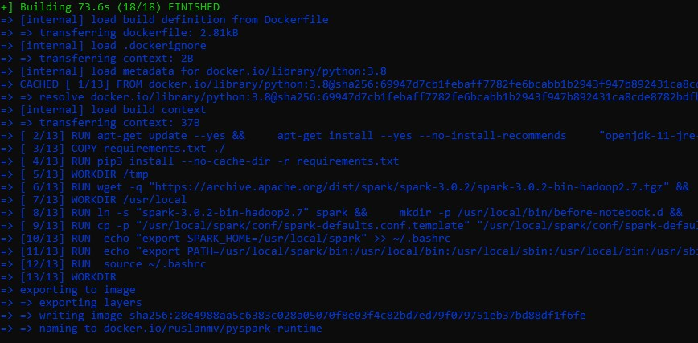
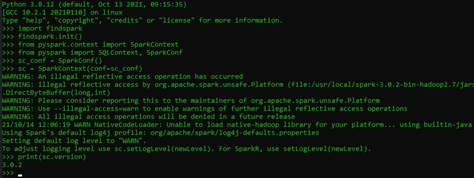

## Python runtime container image for Elyra with Pyspark

This container can have python 3.8 with Apache Spark 3.0.2 

```
docker run  ruslanmv/pyspark-runtime:3.0.2
```


It is a runtime  python3, This is needed to execute a airflow as a runtime

 https://elyra.readthedocs.io/en/v2.1.0/recipes/configure-airflow-as-a-runtime.html


We can build by using our `Dockerfile`

```
docker build --rm -t ruslanmv/pyspark-runtime  .
```




then we run

```
docker run -it ruslanmv/pyspark-runtime
```



```
#Loading Spark
import findspark
findspark.init()
#Importing Spark
import sys
from pyspark.context import SparkContext
from pyspark import SQLContext, SparkConf
print(sys.version)
sc_conf = SparkConf()
sc = SparkContext(conf=sc_conf)
print(sc.version)
3.0.2
```


```
docker tag   28e4988aa5c6 ruslanmv/pyspark-runtime:3.0.2
```

```
docker push ruslanmv/pyspark-runtime:3.0.2
```

It is installed 

**ibm-watson-machine-learning**

**pyspark2pmml**


The check sums are from [here](https://archive.apache.org/dist/spark/spark-3.0.2/spark-3.0.2-bin-hadoop2.7.tgz.sha512)

